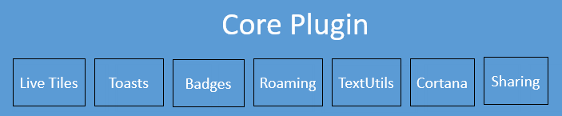
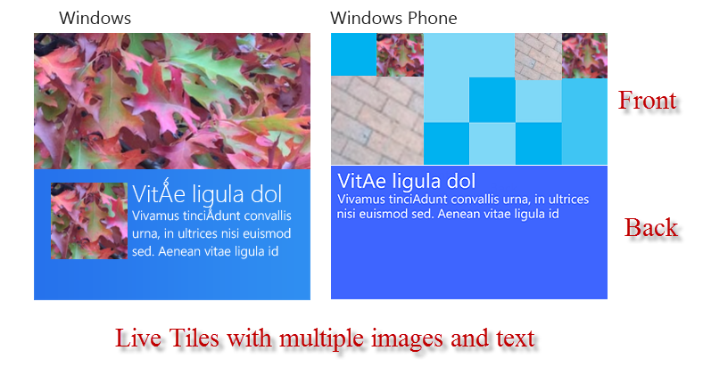

##Introduction

The Core Plugin for Unity contains a group of functionality that we consider core to the integration of an app with the Windows specific features that would help an app Stand out from the crowd and also help them engage the users better. The core plugin contains the following features within it:

 

## Concepts

Here are what the various parts of the Core Plugin do:

* Live Tiles: Windows allows people to pin applications on the Start Menu. A user can decide to give your pinned application icon (Tile) different amount of screen space by sizing it appropriately. Once pinned, your app has the ability to dynamically change the application Tile to one of the system specified templates and adorn it with images and text. This is an unobtrusive way for apps to keep the users engaged by surfacing new and dynamic information every time the  user clicks/taps the start button.
* Toast: This is a small flyout that appears momentarily when something in the app requires urgent action. Unacted upon toasts end up in the Action Center so the user can review them later. Toasts are high impact to user and should be used sparingly and carefully.
* Badges: Like live tile, you can display a number on the tile. This can be used to indicate custom app logic e.g. Lives left, or gifts recieved etc. This is also an unobtrusive way to keep the user engaged by offering them a clue on the application tile itself.
* Roaming: Windows provides each application a small amount of cloud storage without needing to do any explicit configuraton. You simply write to a special folder, called the RoamingSettings and Windows automatically will roam the data to another Windows or Windows Phone where the user is logged in. The storage is relatively small, so this feature is best suited for scores, user profiles, last interacted state etc.
* TextUtils: Ability to save Text and Binary data in a mostly synchronous way to the disk.
* Cortana: Using the power of Cortana Speech to Text, we allow you to add voice interactions to your games
* Sharing: Windows allows apps to be able to share data with each other by offering them an ability to register as either a source or target for sharing. The sharing component allows an app to register to be an easy source of data for sharing.

## Before you use the plugin
>Before you can use any of the plugins, you will have to register the Unity AppCallbacks with the plugin. This is required so that Windows APIs that require the Windows UI thread can run on it and then call any callbacks back on the Unity thread.
>
>To do this, you should place the following line just after *Window.Current.Activate()* in *InitializeUnity* function in App.xaml.cs in the exported Windows Universal project.

```C#
Microsoft.UnityPlugins.Utils.Initialize((action) => AppCallbacks.Instance.InvokeOnAppThread(new AppCallbackItem(() => action()), false));
```


##How to use the APIs

We wrote the plugins with a consistent API surface in mind to ease development. Any of our APIs that can indicate success or failure use a callback mechanism. The callbacks are passed the result of the API call and we always return the result by wrapping it one of the two container classes [*CallbackResponse* or *CallbackResponse<T>*](https://github.com/Microsoft/unityplugins/blob/master/EditorProjects/Microsoft.UnityPlugins.Common/CallbackResponse.cs). There are a small number of exceptions where APIs directly return a result instead of using a callback, but majority of the APIs follow this model. Here is how the callback data structure looks like in case you don't want to click the link above.

```C#
public enum CallbackStatus
{
    Unknown = -1,
    Failure = 0,
    Success = 1,
    TimedOut = 2
}

public class CallbackResponse
{
    public CallbackStatus Status { get; set; }
    public Exception Exception { get; set; }
}

public class CallbackResponse<T> : CallbackResponse
{
    public T Result { get; set; }
}
```

So, if your callback gets invoked, you should make sure to use a pattern similar to check your results:

```C#
SomePluginComponent.SomeAPICall((response) =>
{

    if (response.Status == CallbackStatus.Failure)
    {
        // An error has occured, take appropriate action
		// details of the error are available in the response.Exception
        return;
    }
	
    // If we reach here, the response.Status is success.
	// If the callback takes a CallbackResponse<T>, then 
	// the result will be contained in response.Result.
	// However, if the callback takes a CallbackResponse, 
	// the API does not return any results and trying to 
	// dereference response.Result will hit a NullReferenceException.
});
```

In the above snippet, we provide an overview of how to handle the results coming back from the a generic plugin API call.

## Note about Tile APIs
Note that the tile APIs are designed to simplify how windows tile functionality really works. There are multiple tile templates with a variety of ways in which text and images will be show up on the Live Tile. To understand this, see the illustration below. One single tile can potentially display multiple images as well as multiple text items. The full catalog is documented on [msdn](https://msdn.microsoft.com/en-us/library/windows/apps/windows.ui.notifications.tiletemplatetype.aspx). The functions below assume that when you supply a tile template, **you MUST supply EXACTLY as many strings and EXACTLY as many image paths that tile template requires**. If there is a mismatch in the number of strings/image paths, the tile update will fail silently. If things are not working, make sure you check the numbers carefully. 

 

Finally, if you are using a tile template that needs an image, you will have to copy them to the exported project AFTER exporting. There is no way for us to access any of the assets that are bundled with the Unity project itself. So, this is an additional step. Essentially, this means that after you have exported the Unity project to Windows 10, copy over the images used by the tiles in appropriate folders which the APIs are calling. We would suggest copying over the images to the Assets folder in the exported Windows 10 project to keep things simple. 

## Note about Toast APIs

Just like the Tile APIs, toast APIs support more than one text strings. However, they only allow apps to set one image. The number of string supplied in the API call MUST match the number of strings expected in the template definition else the API will fail silently. For a comprehensive list of Toast templates, see this [msdn page](https://msdn.microsoft.com/en-us/library/windows/apps/windows.ui.notifications.toasttemplatetype.aspx).

## Note about Roaming Settings

Saving the data is only one half of the Roaming equation. The second part of roaming is to take an action when new Roaming Data arrives on a device. Make sure to register an event handler for the *OnDataChanged* event in the RoamingSettings class to be notified whenever the roaming data changes.


## Samples
A sample is included in the [github repository](https://github.com/Microsoft/unityplugins) under *Samples/CoreTest* folder. Cortana samples are present under *Samples/Cortana*. A Windows Store exported project with the appropriate settings is present in the *Samples/CoreTest/out_win10* for Core and *Samples/Cortana/out_win10* folder for cortana.


##API Reference

###Enumerations

An explanation of all the tile types is [here](https://msdn.microsoft.com/en-us/library/windows/apps/windows.ui.notifications.tiletemplatetype.aspx). The same for toasts is [here](https://msdn.microsoft.com/en-us/library/windows/apps/windows.ui.notifications.toasttemplatetype.aspx)

```C#
public enum TileTemplateType
{
    TileSquareImage = 0,
    TileSquareBlock = 1,
    TileSquareText01 = 2,
    TileSquareText02 = 3,
    TileSquareText03 = 4,
    TileSquareText04 = 5,
    TileSquarePeekImageAndText01 = 6,
    TileSquarePeekImageAndText02 = 7,
    TileSquarePeekImageAndText03 = 8,
    TileSquarePeekImageAndText04 = 9,
    TileWideImage = 10,
    TileWideImageCollection = 11,
    TileWideImageAndText01 = 12,
    TileWideImageAndText02 = 13,
    TileWideBlockAndText01 = 14,
    TileWideBlockAndText02 = 15,
    TileWidePeekImageCollection01 = 16,
    TileWidePeekImageCollection02 = 17,
    TileWidePeekImageCollection03 = 18,
    TileWidePeekImageCollection04 = 19,
    TileWidePeekImageCollection05 = 20,
    TileWidePeekImageCollection06 = 21,
    TileWidePeekImageAndText01 = 22,
    TileWidePeekImageAndText02 = 23,
    TileWidePeekImage01 = 24,
    TileWidePeekImage02 = 25,
    TileWidePeekImage03 = 26,
    TileWidePeekImage04 = 27,
    TileWidePeekImage05 = 28,
    TileWidePeekImage06 = 29,
    TileWideSmallImageAndText01 = 30,
    TileWideSmallImageAndText02 = 31,
    TileWideSmallImageAndText03 = 32,
    TileWideSmallImageAndText04 = 33,
    TileWideSmallImageAndText05 = 34,
    TileWideText01 = 35,
    TileWideText02 = 36,
    TileWideText03 = 37,
    TileWideText04 = 38,
    TileWideText05 = 39,
    TileWideText06 = 40,
    TileWideText07 = 41,
    TileWideText08 = 42,
    TileWideText09 = 43,
    TileWideText10 = 44,
    TileWideText11 = 45
}

public enum ToastTemplateType
{
    ToastImageAndText01,
    ToastImageAndText02,
    ToastImageAndText03,
    ToastImageAndText04,
    ToastText01,
    ToastText02,
    ToastText03,
    ToastText04
}

public enum PeriodicUpdateRecurrence
{
    HalfHour  = 0,
    Hour = 1,
    SixHours = 2,
    TwelveHours = 3,
    Daily =4
}
	
public enum SpeechResultStatus
{
    Command = 0, 
    Complete = 1,
    Dictation = 2,
    Hypothesis = 3
}
```	
### Stub/proxy classes

```C#
public class PushNotificationChannel
{
    public DateTime ExpirationTime { get; set; }
    public string Uri { get; set; }
}

public class SpeechArguments
{
    public SpeechResultStatus Status { get; set; }
    public string Text { get; set; }
}
	
```
	
### Core classes

```C#
public class Notifications
{
    public static void CreatePushNotificationChannelForApplication(Action<PushNotificationChannel, Exception> OnPushNotificationChannelCreated);
    public static void CreatePushNotificationChannelForSecondaryTile(string tileId, Action<PushNotificationChannel, Exception> OnPushNotificationChannelForSecondaryTileCreated);
    public static void RegisterForNotifications(Action<object> OnPushNotification, bool cancelDefaultBehavior);
}

public class RoamingSettings
{
    public static String RoamingFolder { get; set; }
    public static ulong RoamingStorageQuota { get; set; }
    public static event Action OnDataChanged;
    public static string[] AllContainerNames { get; }
    public static string[] AllKeys { get; }
    public static void ClearAllApplicationData(Action OnClearAppDataFinished);
    public static void SetValueForKey(string key, object value);
    public static void SetValueForKeyInContainer(string containerName, string key, object value);
    public static void DeleteContainer(string containerName);
    public static void DeleteValueForKey(string key);
    public static void DeleteValueForKeyInContainer(string containerName, string key);
    public static object GetValueForKey(string key);
    public static object GetValueForKey(string key, object defaultValue);
    public static object GetValueForKeyInContainer(string key);
    public static object GetValueForKeyInContainer(string containerName, string key);
    public static object GetValueForKeyInContainer(string containerName, string key, object defaultValue);
}

public class Speech
{
    public static void ListenForCommands(IEnumerable<string> commands, Action<SpeechArguments> OnSpeechResults);
    public static void ListenForDictation(Action<SpeechArguments> OnSpeechResults);
    public static void Stop();
}
```

###Text Utilities

These are synchronous utilities to read and write text and binary bytes to and from the system. The names are pretty self explanatory. As mentioned earlier, these are synchronous and WILL block the thread that you are calling these from. It would be a bad idea to use these to load large amount of data from the UI thread.

```C#
public class TextUtils
{
    public static void WriteAllText(string fileName, string text);
    public static void WriteAllBytes(string fileName, byte[] bytes);
    public static string ReadAllText(string fileName);
    public static byte[] ReadAllBytes(string fileName);
}
```

###Tile Notifications


```C#
public class Tiles
{
    public static void StartPeriodicUpdate(string url, PeriodicUpdateRecurrence periodicUpdateRecurrenceType);
    public static void StartPeriodicUpdate(string url, PeriodicUpdateRecurrence periodicUpdateRecurrenceType,
        DateTime startTime);
    public static void StopPeriodicUpdate();
    public static void enableNotificationQueue(bool enable);
    public static void UpdateTile(TileTemplateType tileTemplateType, string[] text);
    public static void UpdateTile(TileTemplateType tileTemplateType, string[] text, string[] images);
    public static void UpdateTile(string xml, DateTimeOffset? expirationTime);
    public static void UpdateTile(TileTemplateType tileTemplateType, string[] text, string[] images, DateTimeOffset? expirationTime);
    public static string GetTemplateContent(TileTemplateType tileTemplateType);
    public static void ClearTile();
    public static void CreateBadge(String value);
    public static void ClearBadge();
}
	
public class Toasts
{
    public static void ScheduleToast(ToastTemplateType toastTemplateType, string[] text, string image, DateTimeOffset deliveryTime)
    public static void ScheduleToast(ToastTemplateType toastTemplateType, string[] text, DateTimeOffset deliveryTime)
    public static void ShowToast(ToastTemplateType toastTemplateType, string[] text, string image)
    public static void ShowToast(ToastTemplateType toastTemplateType, string[] text, string image, DateTimeOffset? expirationTime)
    public static void ShowToast(ToastTemplateType toastTemplateType, string[] text, string image, DateTimeOffset? expirationTime, Action<string> OnToastDismissed, Action OnToastActivated, Action<Exception> OnToastFailed)
}
	
```

> Note that although we take great effort towards making sure that the API reference is up to date, the [github repository](https://github.com/Microsoft/unityplugins) is the final authority. In particular, the Tiles.cs, Toasts.cs, RoamingSettings.cs, Notifications.cs, TextUtils.cs, Sharing.cs and Speech.cs files in the official repository are the final authoritative source in case documentation and plugin don't seem to be agreeing.

