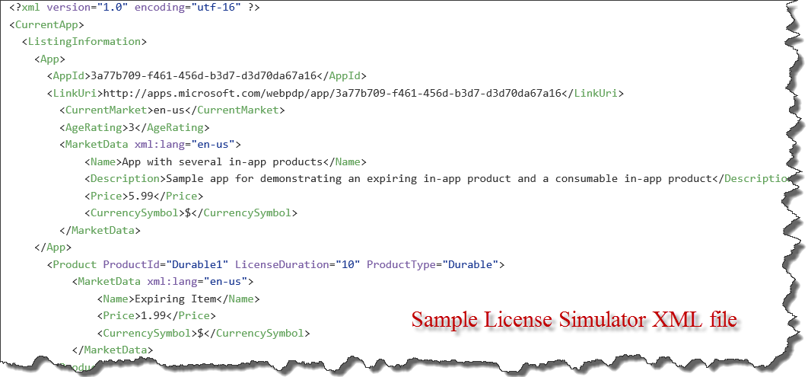
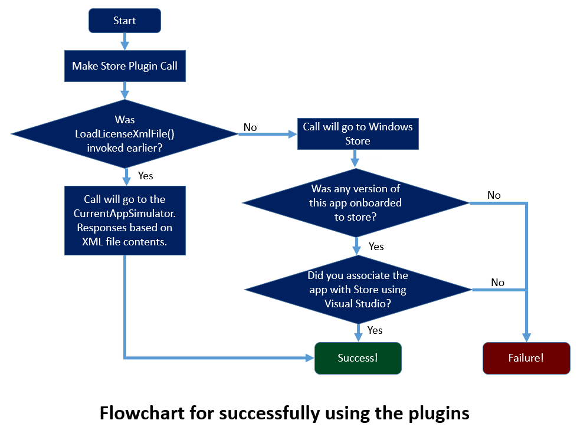

##Introduction
Store Plugin (Microsoft.UnityPlugins.Store.unitypackage) contains APIs to easily integrate Windows Store related functionality into Unity based Windows Store apps. You get the following functionality in a low friction manner via this package:

* Using the Windows Store Licensing Simulator
* App and InApp purchases
* Getting the Listing/Catalog information
* Reporting fulfillment of consumable products
* Receipt download and Receipt verification

## Concepts
 Windows Store APIs can be invoked in two modes: Simulator Mode and against the real Windows Store. To invoke the APIs in Simulator mode, you need to place an XML file containing data that the license simulator will use. 
 
 A simulator XML file contains information such as the app's ID, its store URL, listing information, purchasing information about individual items. See illustration below on how it looks like. A full fledged example is checked into the github repository and is present [here](https://github.com/Microsoft/unityplugins/blob/master/Samples/StoreTest/out_win10/StoreTest/WindowsStoreProxy.xml).

 
 
 You can place the file in the root folder of your app i.e. where the csproj file lives and call it *WindowsStoreProxy.xml*. If you want to name it differently or place it at a different path, you will need to pass the package relative path to the LoadLicenseXMLFile function. 
 
 > Note that by default windows store apps can only access their install folder. Thus, the plugin code assumes that the *WindowsStoreProxy.xml* file will be part of the app package. Hence, the APIs expect the relative path to be relative to the application root. So, if you decide not to store the *WindowsStoreProxy.xml* in the root folder of the app, you *MUST* pass the relative path such as *Assets/MyProxy.xml* assuming that you are storing the proxy file  under the name *MyProxy.xml* in the Assets folder in the exported solution's root folder.
 


To use License Simulator functionality, you MUST first call the *LoadLicenseXMLFile* function before calling any other store function. Invoking this function puts the store plugin in simulator mode. If you do not call this function, the plugin will invoke APIs that call the real Windows Store licensing service.

## Before you use the Plugin

Before you can use any of the plugins, you will have to register the Unity AppCallbacks with the plugin. This is required so that Windows APIs that require the Windows UI thread can run on it and then call any callbacks back on the Unity thread.

To do this, you should place the following line just after *Window.Current.Activate()* in *InitializeUnity* function in App.xaml.cs in the exported Windows Universal project.

```C#
Microsoft.UnityPlugins.Utils.Initialize((action) => AppCallbacks.Instance.InvokeOnAppThread(new AppCallbackItem(() => action()), false));
```


**To test an app against the real Windows Store, the app must be onboarded to the Windows Store**. You may use the Hidden mode of the Windows Store in case you want to create a test app that you do not intend to release but only want to test against. Once an app has been published, you need to do the following:

> * Download the app from the store onto your device
> * Using Visual Studio options (Store->Associate app with store), associate the app with the store. This brings in the right metadata from store into your app.
> * Deploy your app on top of the app obtained from the store. At this point, you should be able to test the APIs against the real Windows Store. Make note that if you have paid In-App purchases, they will charge you real money.

  
## Walkthrough
To make use of the Store APIs, there is a flow of APIs that needs to be maintained to get things working properly. Not following this guidance will lead to many problems and a lot of grief. First, Make sure that  you have thoroughly read the *Before you use the plugin* section above. Not configuring the app correctly is the biggest issue that most app developers on Windows Store face. You have been warned!

 

##How to use the APIs

We wrote the plugins with a consistent API surface in mind to ease development. Any of our APIs that can indicate success or failure use a callback mechanism. The callbacks are passed the result of the API call and we always return the result by wrapping it one of the two container classes [*CallbackResponse* or *CallbackResponse<T>*](https://github.com/Microsoft/unityplugins/blob/master/EditorProjects/Microsoft.UnityPlugins.Common/CallbackResponse.cs). There are a small number of exceptions where APIs directly return a result instead of using a callback, but majority of the APIs follow this model. Here is how the callback data structure looks like in case you don't want to click the link above.

```C#
public enum CallbackStatus
{
    Unknown = -1,
    Failure = 0,
    Success = 1,
    TimedOut = 2
}

public class CallbackResponse
{
    public CallbackStatus Status { get; set; }
    public Exception Exception { get; set; }
}

public class CallbackResponse<T> : CallbackResponse
{
    public T Result { get; set; }
}
```

So, if your callback gets invoked, you should make sure to use a pattern similar to check your results:

```C#
SomePluginComponent.SomeAPICall((response) =>
{

    if (response.Status == CallbackStatus.Failure)
    {
        // An error has occured, take appropriate action
		// details of the error are available in the response.Exception
        return;
    }
	
    // If we reach here, the response.Status is success.
	// If the callback takes a CallbackResponse<T>, then 
	// the result will be contained in response.Result.
	// However, if the callback takes a CallbackResponse, 
	// the API does not return any results and trying to 
	// dereference response.Result will hit a NullReferenceException.
});
```

In the above snippet, we provide an overview of how to handle the results coming back from the a generic plugin API call.

##Sample
A sample is included in the [github repository](https://github.com/Microsoft/unityplugins) under Samples/StoreTest folder. A Windows Store exported project with the appropriate settings is present in the *Samples/StoreTest/out_win10* folder.

## API Reference and usage
### Store class 

The Store class functions provide the bulk of the Store Plugin implementation. See below for specifics on how to use each API

```C#
public static void RegisterForLicenseChangeEvents(Action OnLicenseChangedHandler);
```

RegisterForLicenseChangeEvents API is a delegate that can be used to register for a callback whenever a license changed event occurs. Realistically, the only time this event would normally be called is when a trial version of the app is running and the trial expires. In such case, you can disable the trial functionality and prompt the user to purchase the full app.

```C#
public static bool IsInTrialMode();
public static LicenseInformation GetLicenseInformation();
public static ProductLicense GetProductLicense(string productId);
```

IsInTrialMode simply returns a bool value designating if the application is in trial mode. Similarly, *GetLicenseInformation* returns the current License state of the app. This is a purely local call and does not query the Store servers for uptodate license information. GetProductLicense call is similar to the GetLicenseInformation and does not make a network call and instead returns whatever the last known state of the license was for the in-app specified by the  name *productId*.

```C#	
public static void LoadLicenseXMLFile(Action<CallbackResponse> callback, 
		string licenseFilePath = null);
```

*LoadLicenseXMLFile* is usually the first call in the Store plugin to be invoked in your code if you are testing the licensing functionality. See the beginning of this page to see how to create such a file. Alternately, if you do not want to place this file in the root of the app's installation folder, the licenseFilePath is a *relative path* to the installation directory.


```c#
public static void LoadListingInformation(
		Action<CallbackResponse<ListingInformation>> OnLoadListingFinished);
```

*LoadListingInformation* API downloads the entire catalog of in-app purchases available for the app including their purchase prices etc. This API issues a network call and hence requires a callback to be invoked when the network call is finished. 

>Note:  This API can work in simulator anytime. If you did not invoke LoadLicenseXMLFile, this API will contact the Windows Store and provide the app identification and query if an app specified by the ID exists. If your app is not live on the store in any mode, including hidden, this API WILL return an error value. See the beginning of this page or the home page for how to associate your app with store to make this API work.


```C#	
public static void RequestAppPurchase(bool requireReceipt, 
		Action<CallbackResponse<string>> OnAppPurchaseFinished);
```

*RequestAppPurchase* request for a purchase of your application. If the application is in trial mode, user will be prompted to purhcase the app. If the app is not in trial mode, nothing will happen.

>Note:  This API can work in simulator anytime. If you did not invoke LoadLicenseXMLFile, this API will contact the Windows Store and provide the app identification and query if an app specified by the ID exists. If your app is not live on the store in any mode, including hidden, this API WILL return an error value. See the beginning of this page or the home page for how to associate your app with store to make this API work.

	
```C#	
public static void RequestProductPurchase(string productId, 
		Action<CallbackResponse<PurchaseResults>> OnProductPurchaseFinished);
```

*RequestProductPurchase* will prompt the user to purchase the In-App purchase specified by the identifier *productId*. The user will be prompted to purchase this IAP. However, if this IAP is a consumable IAP and has already been previously purchased by the  user and has not been yet been consumed, the user will not be prompted. Instead, the callback will be invoked with the PurchaseResults' ReceiptXml field filled. You MUST call the *ReportConsumableFulfillment* API successfully for a previous purchase of the same IAP to be able to prompt the user to purchase the item again.

>Note:  This API can work in simulator anytime. If you did not invoke LoadLicenseXMLFile, this API will contact the Windows Store and provide the app identification and query if an app specified by the ID exists. If your app is not live on the store in any mode, including hidden, this API WILL return an error value. See the beginning of this page or the home page for how to associate your app with store to make this API work.


```C#
public static void GetAppReceipt(Action<CallbackResponse<string>> OnAppReceiptAcquired);
```

*GetAppReceipt* API will contact the Windows Store and attempt to get a receipt for the application. This might be useful to do immediately after your app changes state from Trial to full. You can verify the signed receipts in isolation.

>Note:  This API can work in simulator anytime. If you did not invoke LoadLicenseXMLFile, this API will contact the Windows Store and provide the app identification and query if an app specified by the ID exists. If your app is not live on the store in any mode, including hidden, this API WILL return an error value. See the beginning of this page or the home page for how to associate your app with store to make this API work.

```C#
public static void GetProductReceipt(string productId, 
		Action<CallbackResponse<string>> OnProductReceiptAcquired);
```

*GetProductReceipt* API will contact the Windows Store and attempt to get a receipt for an IAP. This might be useful to do immediately after your app changes state from Trial to full. You can verify the signed receipts in isolation

>Note:  This API can work in simulator anytime. If you did not invoke LoadLicenseXMLFile, this API will contact the Windows Store and provide the app identification and query if an app specified by the ID exists. If your app is not live on the store in any mode, including hidden, this API WILL return an error value. See the beginning of this page or the home page for how to associate your app with store to make this API work.

	
```C#	
public static void LoadUnfulfilledConsumables(
		Action<CallbackResponse<List<UnfulfilledConsumable>>> OnLoadUnfulfilledConsumablesFinished);
```

*LoadUnfulfilledConsumables* API will return all the unfulfilled consumables for this application. Unless you are tracking all the information for your app locally, when you need to report a consumable fulfillment, you need the *TransactionId*  from the response of this API to call *ReportConsumableFulfillment* API.

>Note:  This API can work in simulator anytime. If you did not invoke LoadLicenseXMLFile, this API will contact the Windows Store and provide the app identification and query if an app specified by the ID exists. If your app is not live on the store in any mode, including hidden, this API WILL return an error value. See the beginning of this page or the home page for how to associate your app with store to make this API work.

	
```C#	
public static void ReportConsumableFulfillment(string productId, Guid transactionId,
		Action<CallbackResponse<FulfillmentResult>> OnReportConsumableFulfillmentFinished);
```	

*ReportConsumableFulfillment* API calls the Windows Store and notifies it that a consumable has been consumed by the user. This allows the user to purchase the same IAP again.

>Note:  This API can work in simulator anytime. If you did not invoke LoadLicenseXMLFile, this API will contact the Windows Store and provide the app identification and query if an app specified by the ID exists. If your app is not live on the store in any mode, including hidden, this API WILL return an error value. See the beginning of this page or the home page for how to associate your app with store to make this API work.


### Enumerations

The following enumerations are provided for sake of completness as they are used by various APIs in the Store Plugin documentation.

```C#
public enum FulfillmentResult
{
    Succeeded  = 0,
    NothingToFulfill = 1,
    PurchasePending = 2,
    PurchaseReverted = 3,
    ServerError = 4
}


public enum ProductPurchaseStatus
{
    Succeeded = 0,
    AlreadyPurchased = 1,
    NotFulfilled = 2,
    NotPurchased = 3
}

public enum ProductType
{
    Unknown = 0,
    Durable = 1,
    Consumable = 2
}

```

### Stub/proxy classes

Just like enumerations, the following classes simply act as containers for passing data around. They are provided for sake of completeness.

```C#
public class LicenseInformation
{
    public DateTime ExpirationDate { get; set; }
    public Dictionary<string, ProductLicense> ProductLicenses { get; set; }
    public bool IsActive { get; set; }
    public bool IsTrial { get; set; }
}

public class ListingInformation
{
    public uint AgeRating { get; set; }
    public string CurrentMarket { get; set; }
    public string Description { get; set; }
    public string FormattedPrice { get; set; }
    public string Name { get; set; }
    public Dictionary<string, ProductListing> ProductListings { get; set; }
}

public class ProductLicense
{
    public DateTime ExpirationDate { get; set; }
    public bool IsActive { get; set; }
    public string ProductId { get; set; }
}

public class ProductListing
{
        public string FormattedPrice { get; set; }
        public string Name { get; set; }
        public string ProductId { get; set; }
}	

public class PurchaseResults
{
    public string OfferId { get; set; }
    public string ReceiptXml { get; set; }
    public ProductPurchaseStatus Status { get; set;}
    public string TransactionId { get; set; }
}

public enum StatusCodeType
{
    Failure = 0,
    Success = 1
}
public class ReceiptResponse
{
    public string Description { get; set; }
    public StatusCodeType Status { get; set; }
    public string AppId;
    public List<Product> ProductIDs;
    public string ReceiptId;
    public bool IsValidReceipt;
    public bool IsBeta;
}

public class Product
{
    public string ReceiptId;
    public string ProductId;
}

public class UnfulfilledConsumable
{
    public string OfferId { get; set; }
    public string ProductId { get; set; }
    public Guid TransactionId { get; set; }

}
	
```

> Note that although we take great effort towards making sure that the API reference is up to date, the [github repository](https://github.com/Microsoft/unityplugins) is the final authority. In particular, the [Store.cs File](https://github.com/Microsoft/unityplugins/blob/master/EditorProjects/Microsoft.UnityPlugins.Store/Store.cs) in the official repository is the final authoritative source in case documentation and plugin don't seem to be agreeing.
